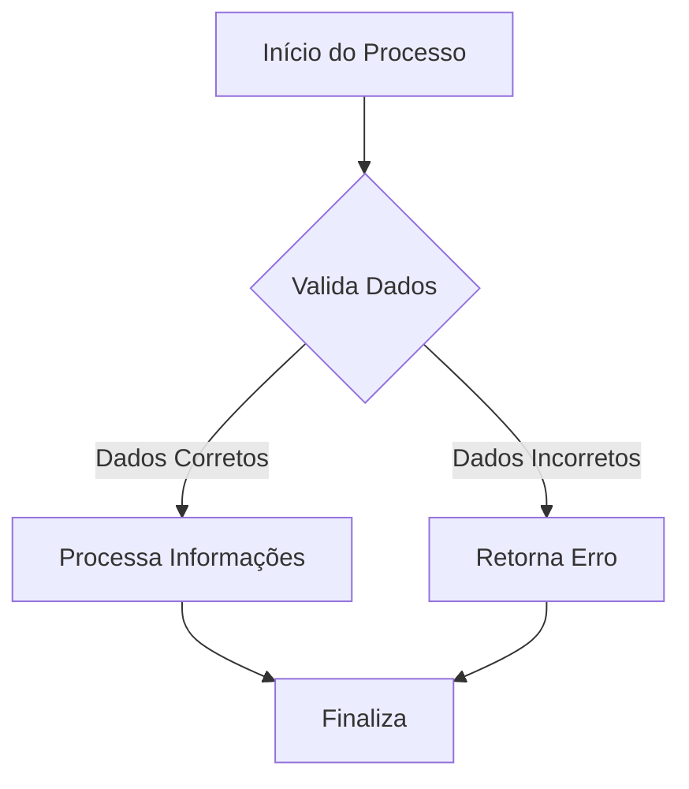
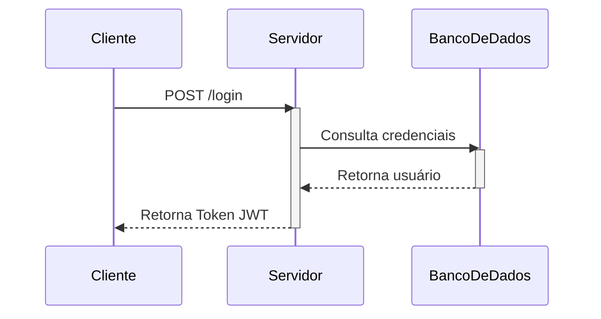

# Documentação do Projeto Exemplo 

Este é um exemplo de arquivo `.md` demonstrando a integração de textos, snippets de código e diagramas gerados por texto.

## 1. Exemplo de Código (JavaScript)
Blocos de código são gerados utilizando três acentos graves (\`\`\`) seguidos da linguagem.

```javascript
function saudacao(nome) {
    const mensagem = `Olá, ${nome}! Bem-vindo ao projeto.`;
    console.log(mensagem);
    return mensagem;
}

saudacao("Desenvolvedor");
```

## 2. Exemplo de Diagrama (Fluxo)
Você pode utilizar a sintaxe **Mermaid** para criar diagramas direto no arquivo Markdown. A maioria das plataformas (como GitHub ou editores como VS Code) renderiza o código abaixo como um fluxograma visual.



## 3. Exemplo de Diagrama (Sequência)
Também é possível documentar fluxos de interação ou chamadas de API utilizando diagramas de sequência.



---
Para mais detalhes sobre a sintaxe, visite a [Documentação oficial de Escrita do GitHub](https://docs.github.com/pt/get-started/writing-on-github/getting-started-with-writing-and-formatting-on-github/basic-writing-and-formatting-syntax).
